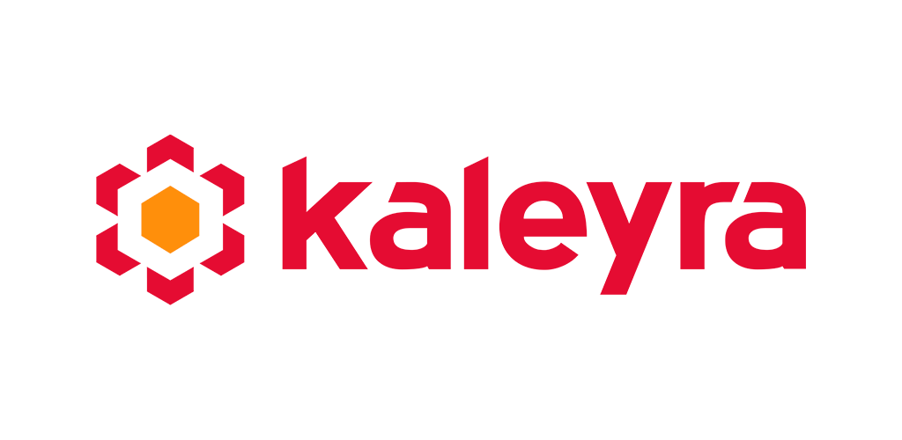

<p align="center">

</p>


[ ](https://maven.bandyer.com/index.html#releases/com/kaleyra/collaboration-suite-utils/)[](https://github.com/Bandyer/Bandyer-Android-Common/actions/workflows/android.yml)[](https://bandyer.github.io/Bandyer-Android-Common/kDoc)
[](https://twitter.com/intent/follow?screen_name=Kaleyra_)


Kaleyra video enables audio/video communication and collaboration from any platform and browser! Through its WebRTC architecture, it makes video communication simple and punctual.

---


**[Installation](#installation)** .
**[Documentation](#documentation)** .
**[Support](#support)** .
**[Credits](#credits)** .

---

## Installation

Download the [latest AAR](https://maven.bandyer.com/index.html#releases/com/kaleyra/collaboration-suite-utils/) or grab via Gradle:

```groovy
implementation "com.kaleyra:collaboration-suite-utils:$latestKaleyraCollaborationSuiteUtilsVersion"
```

## Documentation

You can find the complete documentation in two different styles

Kotlin Doc: [https://docs.bandyer.com/Kaleyra-Android-Collaboration-Suite-Utils/](https://docs.bandyer.com/Kaleyra-Android-Collaboration-Suite-Utils/)

## Support
To get basic support please submit an [Issue](https://github.com/Bandyer/Kaleyra-Android-Collaboration-Suite-Utils/issues) 

If you prefer commercial support, please contact [kaleyra](https://kaleyra.com) by mail: <mailto:info@bandyer.com>.


## Credits
- [Android-weak-handler](https://github.com/badoo/android-weak-handler) by Badoo
